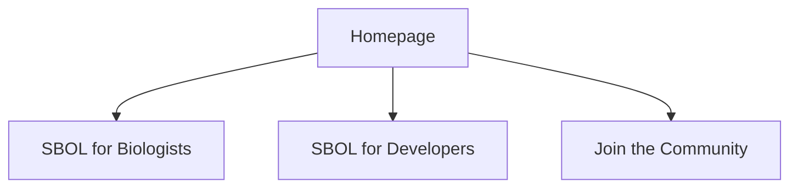
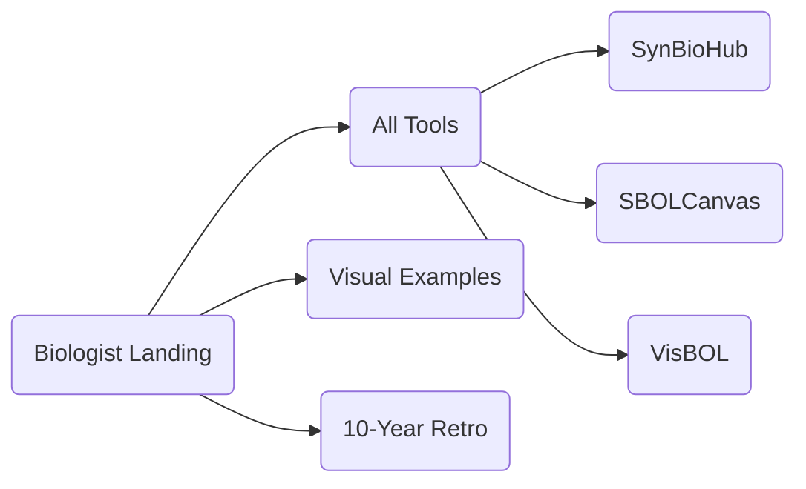
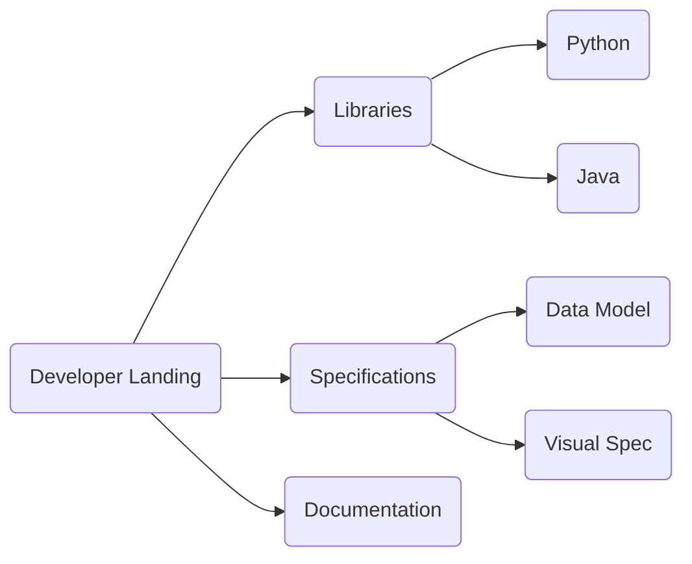

# SBOL Website - Site Map and User Flow

This document outlines the proposed navigation structure and user flows for the SBOL website. The goal is to stream users into three distinct paths from the homepage.

## 1. Homepage High-Level Flow

The homepage will serve as the primary router with three clear "Call to Action" sections:

---

## 2. User Journey: Biologist
**Goal**: Discover tools to visualize, store, and publish designs without coding.

*   **Landing Page**: `/biologist/` (Existing)
    *   *Content*: Intro, Highlighted Tools (SynBioHub, SBOLCanvas), History.
*   **Suggested Sub-Pages / Navigation**:
    *   **Tools Showcase**: `/biologist/tools/` (Suggest creating)
        *   *Filters*: "Visualization", "Repository", "Design"
        *   *Content*: Links to specific application pages.
        *   *Relevant Apps*:
            *   [SynBioHub](/applications/synbiohub/)
            *   [SBOLCanvas](/applications/sbolcanvas/)
            *   [SBOLDesigner](/applications/sboldesigner/)
            *   [VisBOL](/applications/visbol/)
            *   [GeneGenie](/applications/genegenie/)
    *   **Visual Examples**: `/visual-examples/` (Existing)
    *   **Learning Resources**:
        *   [10 Years of SBOL Visual](/sbolv-10-years/)

---

## 3. User Journey: Developer
**Goal**: Build software using SBOL, understand the spec, and integrate libraries.

*   **Landing Page**: `/developer/` (Suggest creating)
    *   *Content*: "Get Started", Links to Libraries, Links to Specs.
*   **Key Sub-Sections**:
    *   **Software Libraries**: `/libraries/` (Existing)
        *   [Python](/libraries/python/)
        *   [Java](/libraries/java/)
        *   [C++](/libraries/cpp/)
        *   [JavaScript](/libraries/javascript/)
    *   **Specifications**: `/specifications/` (Suggest grouping existing spec folders)
        *   [Data Model 3.0](/DataModel-Specification/version-3.0.0/)
        *   [Visual 3.0](/visual-specification/version-3.0.0/)
        *   [Ontology](/ontology/)
    *   **Developer Tools**:
        *   [Validator](/applications/sbolvalidator/)
        *   [Converters](/applications/sbolgenbank/)
    *   **Tutorials/Docs**:
        *   [Data Model Examples](/DataModel-Examples/)

---

## 4. User Journey: Join SBOL (Community)
**Goal**: Participate in governance, attend events, and connect.

*   **Landing Page**: `/community/` (Existing)
    *   *Content*: Overview of the community structure.
*   **Sub-Pages**:
    *   **Events**: `/event/` (Existing - List of workshops/meetings)
        *   *Highlight*: IWBDA, HARMONY, COMBINE.
    *   **Governance**: `/community-governance/` (Existing)
    *   **Outreach**: `/community-outreach/` (Existing)
    *   **Contact**: `/contact/` (Existing)

---

## 5. Miscellaneous / Footer Menu
Pages that don't fit the main flow but must be accessible.

*   **About**: `/about/` (General project info)
*   **Legal**:
    *   [Privacy Policy](/privacy/)
    *   [Terms](/terms/)
*   **FAQ**: `/faq/`

---

## Content Inventory & Categorization
Below is a mapping of your current content directories to these new categories.

| Directory | Proposed Category | Notes |
| :--- | :--- | :--- |
| `content/biologist/` | **Biologist** | primary landing |
| `content/applications/` | **Shared** | Needs curation. "Biologist" apps vs "Developer" utilities. |
| `content/visual-examples/` | **Biologist** | |
| `content/visual-glyphs/` | **Biologist** | |
| `content/sbolv-10-years/` | **Biologist** | |
| `content/libraries/` | **Developer** | |
| `content/DataModel-Specification/`| **Developer** | |
| `content/visual-specification/` | **Developer** | |
| `content/ontology/` | **Developer** | |
| `content/DataModel-Examples/` | **Developer** | |
| `content/community*/` | **Join/Community** | |
| `content/event/` | **Join/Community** | |
| `content/home/` | **Homepage** | Components for the home page |
| `content/post/` | **Blog** | Could be under Community or separate |
| `content/publication/` | **Academic** | Linked from "About" or "Research" |

## Recommendations
1.  **Create `/developer/` Landing Page**: Similar to the Biologist one, acting as a portal.
2.  **Split `applications`**: The `/applications/` folder is currently a flat list. Consider tagging them in Hugo frontmatter as `audience: biologist` or `audience: developer` to auto-filter them onto the respective landing pages.
3.  **Consolidate Specifications**: Create a unified `/specifications/` landing page that links to both Data Component and Visual Component specs to reduce clutter.
